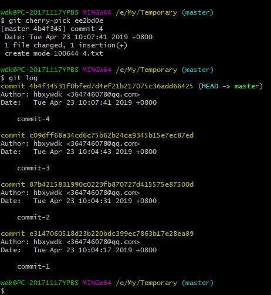

### 使用git reflog恢复已删除提交
假设有三次提交


被不小心使用了
```
git reset --hard e3147060518d23b220bdc399ec7863b17e28ea89
```
重置到了commit-1，这时我们查看git log


之后我们又提交了一个commit-4


`这时我们发现我们操作了错误的reset，丢掉了commit-2，commit-3，要如何做才能在保留commit-4的情况下恢复commit-2和commit-3？`

答案：使用`git reflog和git cherry-pic`

git reflog可以记录几乎所有本地仓库的改变，我们使用它可以看到我们之前所有的操作：


截图中我们看到commit-3的hash码是`c09dff6`，commit-4的hash码是`ee2bd0e`，我们先回滚到commit-3上：
```
git reset --hard c09dff6
```
可以看到我们找回了之前的提交


但是要如何找回我们的`commit-4`呢？这时我们就要使用git cherry-pick命令加上之前`commit-4`的hash码
```
git cherry-pick ee2bd0e
```
可以看到，我们在保留了`commit-4`的情况下成功找回了`commit-2`和`commit-3`




