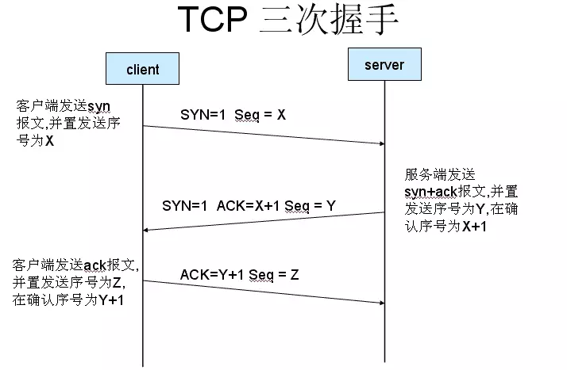
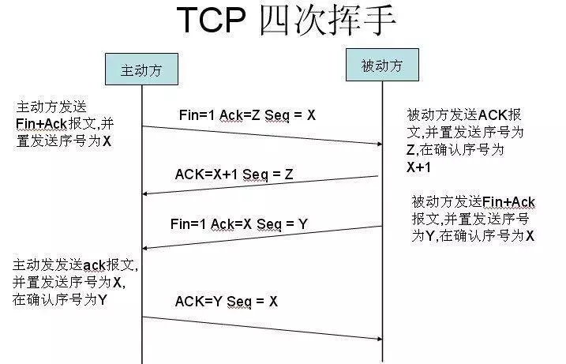

#### 简述HTTP协议
HTTP协议，全名hypertext transfer protocol，中文名超文本传输协议。
它是提供WWW服务的重要组成部分，HTTP协议的最初目的是提供一种发布和接受HTML页面的方法。
无连接、无状态、基于TCP/IP通信协议来传递数据。

#### 一些常见HTTP状态码
- 200 OK
- 301 当客户端触发的动作引起了资源URI的变化时发送此响应代码。另外，当客户端向一个资源的旧URI发送请求时，也发送此响应代码。
- 304 Not Modified
- 307 请求还没有被处理，因为所请求的资源不在本地：它在另一个URI处。
- 400 通用的客户端错误状态，当其他4XX响应代码不适用时，就采用400。此响应代码通常用于“服务器收到客户端通过PUT或者POST请求提交的表示，表示的格式正确，但服务器不懂它什么意思”的情况。
- 401 客户端试图对一个受保护的资源进行操作，却又没有提供正确的认证证书。
- 403 暗示了所请求的资源确实存在。跟401一样，若服务器不想透露此信息。
- 404 未找到资源。
- 405 不支持该请求方法。
- 500 服务器错误
- 502 它表明代理方面出现问题，或者代理与上行服务器之间出现问题，而不是上行服务器本身有问题。

更多：https://www.cnblogs.com/xflonga/p/9368993.html

#### 浏览器限制最大TCP连接数量的原因
HTTP协议早期，我们发送一个请求，服务器收到并做出响应后才会进行下一个请求，这样十分没有效率。
后来在HTTP/1.1中提出了`管线化(pipelining)技术`，允许一次性发送多个请求。然而管线化技术在接收response时需要按照请求发出的顺序依次接收服务器响应。
如果这`一组请求中一旦有请求阻塞了，后面的所有请求都会进入等待状态`，这也是`浏览器限制最大TCP连接数的原因`。
（前端性能优化.md 中有解决最大连接数量的方法）

#### DNS解析会出错吗，以及原因
会
- 域名记录不存在
- 权威解析失败
- 拒绝服务
- 递归服务器本身不响应

https://zhuanlan.zhihu.com/p/40659713

#### TCP如何保证可靠性
校验和、序列号、确认应答、超时重传、连接管理、流量控制、拥塞控制
https://blog.csdn.net/liuchenxia8/article/details/80428157

#### TCP与UDP区别
UDP面向无连接，不需要像TCP那样三次握手，四次挥手，想发送数据就可以发送； 
UDP不可靠，只对数据进行搬运，不对数据做任何操作，不保证数据能正确有序的传给对方； 
UDP很高效，没有任何控制流量的算法，UDP十分轻便；

#### 简述DNS解析流程
1. 首先在本地计算机的缓存中查找，找到则使用本地。没找到，则向DNS服务器发起查询请求。
2. 客户机将域名查询请求发送到本地DNS服务器，本地DNS服务器首先在该服务器管理的区域的记录中查找，如果找到该记录，则利用此记录进行解析；如果没有区域信息可以满足查询要求，服务器在本地的缓存中查找。
3. 如果本地服务器不能在本地找到客户机查询的信息，将客户机请求发送到根域名DNS服务器。
4. 根域名服务器负责解析客户机请求的根域部分，它将包含下一级域名信息的DNS服务器地址返回给客户机的DNS服务器地址。

tips：DNS通常使用UDP协议

https://blog.csdn.net/YZS_L_H/article/details/69751353

#### 为什么TCP连接的建立需要3次握手，而不是2次或4次？
直接说大白话把，请搭配底下的两张图食用：
- `第一次握手后`，客户端可以确认自己发报文功能正常，服务端可以确认自己收报文功能正常。
- `第二次握手后`，客户端可以确认自己发收文功能正常，服务端可以确认自己发报文功能正常。也就是说客户端与服务端的收发报文功能都正常，已经可以认为连接已建立了。 
- 那么为什么需要`第三次握手`呢？因为如果客户端没有成功收到第二次握手，这时服务端认为已经建立了连接，客户端却认为没有建立连接，服务器就白白浪费了资源。
- `那为什么不是四次握手呢`？因为三次就足以确认连接的建立，弄更多也只是再浪费。

#### 为什么断开TCP连接需要4次挥手，而不是其他次数？
还是大白话：
- 客户端要断开连接，会有`第一次挥手`，告诉服务器，我已经没有东西要向你发送了。
- 服务端收到断开连接请求，会有`第二次挥手`，告诉客户端，我知道了。
- 但是！但是！但是！这个时候服务端可能还有数据需要向客户端发送。
- 当服务器没有数据要发送了，这个时候会有`第三次挥手`，告诉客户端，我数据发完了。
- 客户端收到后会发生`第四次挥手`，告诉服务端，我知道了。之后连接断开。

##### 三次握手和四次挥手

https://juejin.im/post/5cb93204f265da039955d770

